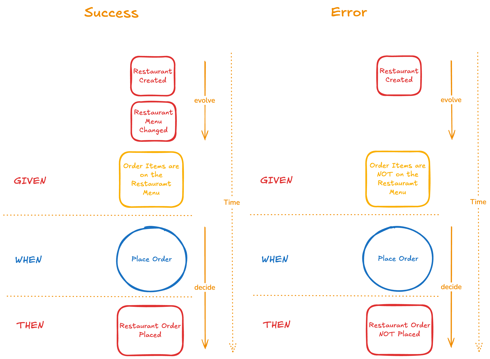

# Restaurant Order Management — Deno Fresh Demo

A restaurant and order management demo built with
[Deno Fresh v2](https://fresh.deno.dev), showcasing the **Dynamic Consistency
Boundary (DCB)** pattern from
[`fmodel-decider`](https://jsr.io/@fraktalio/fmodel-decider) with
[Deno KV](https://docs.deno.com/deploy/kv/manual/) as a robust event store
implementation that natively supports DCB.

## Event Modeling

The domain is designed using [Event Modeling](https://eventmodeling.org) — a
blueprint that maps out commands, events, read models, and UI interactions in a
single visual artifact.


## Tech Stack

| Layer      | Technology                                                                            |
| ---------- | ------------------------------------------------------------------------------------- |
| Runtime    | [Deno](https://deno.com) with `--unstable-kv`                                         |
| Framework  | [Fresh v2](https://fresh.deno.dev) (Preact, islands architecture)                     |
| Styling    | [Tailwind CSS v4](https://tailwindcss.com)                                            |
| Database   | [Deno KV](https://docs.deno.com/deploy/kv/manual/) (built-in, zero config)            |
| Domain     | [`@fraktalio/fmodel-decider`](https://jsr.io/@fraktalio/fmodel-decider) (DCB pattern) |
| Auth       | [GitHub OAuth](https://jsr.io/@deno/kv-oauth) via `@deno/kv-oauth`                    |
| Validation | [Zod](https://zod.dev)                                                                |
| Testing    | `Deno.test`, [`fast-check`](https://fast-check.dev) (property-based)                  |

## Dynamic Consistency Boundary (DCB)

Unlike the traditional aggregate pattern, DCB defines consistency boundaries
**per use case** rather than per entity. Each decider focuses on a single
command and declares exactly which events it needs to make its decision.

`DcbDecider<Command, State, InputEvent, OutputEvent>` distinguishes between
input events (what the decider reads to build state) and output events (what it
produces) at the type level. This means the compiler enforces that `decide` only
returns output events and `evolve` handles all input events — making pattern
matching exhaustive and the entire pipeline type-safe.

### Use-Case Deciders

| Decider                       | Command                       | Reads                                                                                | Produces                     |
| ----------------------------- | ----------------------------- | ------------------------------------------------------------------------------------ | ---------------------------- |
| `createRestaurantDecider`     | `CreateRestaurantCommand`     | `RestaurantCreatedEvent`                                                             | `RestaurantCreatedEvent`     |
| `changeRestaurantMenuDecider` | `ChangeRestaurantMenuCommand` | `RestaurantCreatedEvent`, `RestaurantMenuChangedEvent`                               | `RestaurantMenuChangedEvent` |
| `placeOrderDecider`           | `PlaceOrderCommand`           | `RestaurantCreatedEvent`, `RestaurantMenuChangedEvent`, `RestaurantOrderPlacedEvent` | `RestaurantOrderPlacedEvent` |
| `markOrderAsPreparedDecider`  | `MarkOrderAsPreparedCommand`  | `RestaurantOrderPlacedEvent`, `OrderPreparedEvent`                                   | `OrderPreparedEvent`         |

Notice how `placeOrderDecider` spans both Restaurant and Order concepts —
something that's natural in DCB but would require a saga or process manager in
the aggregate pattern.

### Event Repository (Deno KV)

A production-ready event-sourced repository using Deno KV with optimistic
locking, flexible querying, and type-safe tag-based indexing.


The storage layout uses three key patterns:

| Index              | Key Pattern                                       | Value                       |
| ------------------ | ------------------------------------------------- | --------------------------- |
| Primary storage    | `["events", eventId]`                             | Full event data             |
| Tag index          | `["events_by_type", eventType, ...tags, eventId]` | `eventId` (pointer)         |
| Last event pointer | `["last_event", eventType, ...tags]`              | `eventId` (mutable pointer) |

Event data is stored once; secondary indexes store only ULID pointers. The
repository automatically generates all tag subset combinations (2^n - 1 indexes
per event), enabling flexible querying by any combination of tag fields. Last
event pointers enable optimistic locking via Deno KV versionstamp checks.

Each decider has its own repository with tuple-based queries that load only the
events it needs (sliced/vertical approach):

```ts
const repository = createRestaurantRepository(kv);
const cmdHandler = new EventSourcedCommandHandler(
  createRestaurantDecider,
  repository,
);
const events = await cmdHandler.handle(createRestaurantCommand);
```

## Specification by Example (Given/When/Then)

Deciders are tested using a **Given/When/Then** format powered by
`DeciderEventSourcedSpec`. This makes tests read like executable specifications:



```ts
Deno.test("Place Order - Success", () => {
  DeciderEventSourcedSpec.for(placeOrderDecider)
    .given([
      {
        kind: "RestaurantCreatedEvent",
        restaurantId: restaurantId("restaurant-1"),
        name: "Italian Bistro",
        menu: testMenu,
        final: false,
        tagFields: ["restaurantId"],
      },
    ])
    .when({
      kind: "PlaceOrderCommand",
      restaurantId: restaurantId("restaurant-1"),
      orderId: orderId("order-1"),
      menuItems: testMenuItems,
    })
    .then([
      {
        kind: "RestaurantOrderPlacedEvent",
        restaurantId: restaurantId("restaurant-1"),
        orderId: orderId("order-1"),
        menuItems: testMenuItems,
        final: false,
        tagFields: ["restaurantId", "orderId"],
      },
    ]);
});
```

Error scenarios use `.thenThrows()`:

```ts
DeciderEventSourcedSpec.for(placeOrderDecider)
  .given([])
  .when(placeOrderCommand)
  .thenThrows((error) => error instanceof RestaurantNotFoundError);
```

## Views (Ad-hoc / Live Read Models)

Views are pure `Projection` functions that fold events into denormalized
read-model state. Two views exist — `orderView` and `restaurantView` — each
handling only the events it cares about, with exhaustive pattern matching.

At runtime, an `EventSourcedQueryHandler` wires a view to Deno KV via
`DenoKvEventLoader`, building the projection on demand from stored events (no
separate read database needed).

Views are tested with a **Given/Then** format using `ViewSpecification`:

```ts
Deno.test("Order View - Order Prepared Event", () => {
  ViewSpecification.for(orderView)
    .given([
      {
        kind: "RestaurantOrderPlacedEvent",
        orderId: orderId("order-1"),
        restaurantId: restaurantId("restaurant-1"),
        menuItems: testMenuItems,
        final: false,
        tagFields: ["restaurantId", "orderId"],
      },
      {
        kind: "OrderPreparedEvent",
        orderId: orderId("order-1"),
        final: false,
        tagFields: ["orderId"],
      },
    ])
    .then({
      orderId: orderId("order-1"),
      restaurantId: restaurantId("restaurant-1"),
      menuItems: testMenuItems,
      status: "PREPARED",
    });
});
```

## Project Structure

```
├── lib/                        # Domain logic (event-sourced, pure functions)
│   ├── api.ts                  # Shared types: branded IDs, commands, events, errors
│   ├── *Decider.ts             # Use-case deciders (pure decide + evolve)
│   ├── *Repository.ts          # Deno KV-backed repositories (one per decider)
│   ├── *View.ts                # Read-model projections
│   ├── *ViewEventLoader.ts     # Wire views to KV event storage
│   └── *_test.ts               # Co-located tests
├── routes/                     # Fresh file-system routing
│   ├── api/                    # JSON API endpoints
│   │   ├── restaurant/         # Restaurant CRUD
│   │   ├── order/              # Order management
│   │   ├── kitchen/            # Kitchen operations
│   │   └── me/                 # Current user info
│   ├── dashboard/              # Protected dashboard page
│   ├── restaurant/             # Restaurant management page
│   ├── order/                  # Order management page
│   └── kitchen/                # Kitchen dashboard page
├── islands/                    # Interactive Preact components (client-hydrated)
├── components/                 # Static Preact components (server-rendered)
├── middleware/                  # Session and auth middleware
├── utils/                      # Auth, DB, error helpers
├── assets/styles.css           # Tailwind CSS entry point
├── static/                     # Static assets (fonts, logos)
├── main.ts                     # Server entry point
├── client.ts                   # Client entry point
├── deno.json                   # Config, deps, tasks
└── vite.config.ts              # Vite + Fresh + Tailwind config
```

## Getting Started

### Prerequisites

- [Deno](https://docs.deno.com/runtime/getting_started/installation) installed
- A [GitHub OAuth App](https://github.com/settings/developers) for
  authentication

### Setup

1. Clone the repo and create a `.env` file with your GitHub OAuth credentials:

   ```env
   GITHUB_CLIENT_ID=your_client_id
   GITHUB_CLIENT_SECRET=your_client_secret
   ```

2. Start the dev server:

   ```bash
   deno task dev
   ```

### Common Commands

```bash
# Development server
deno task dev

# Production build + start
deno task build
deno task start

# Lint, format, and type check
deno task check

# Run all tests
deno test --allow-all --unstable-kv

# Run a specific test file
deno test --allow-all --unstable-kv lib/placeOrderDecider_test.ts
```

## License

MIT
